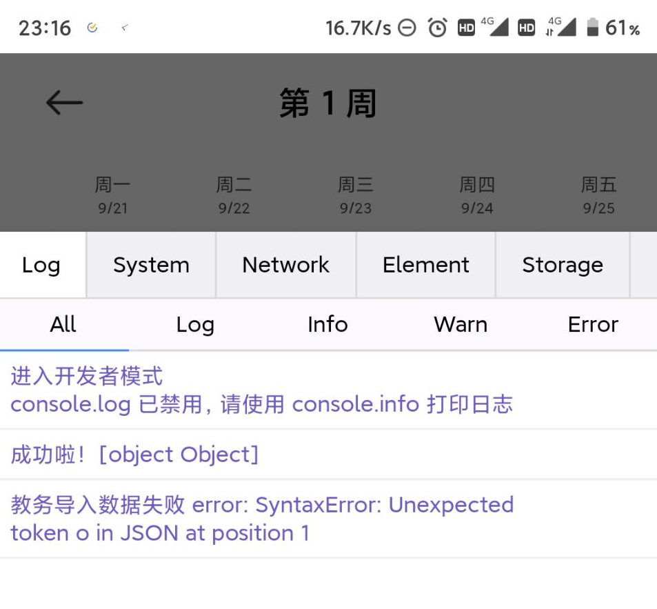

# AISchedule_SCAU

MIUI小爱课程表 - 华南农业大学新教务系统课程表解析

## 简述

核心文件其实就这两个：

- `./src/scheduleHtmlProvider.js`
- `./src/scheduleHtmlParser.js`

其他的html和js只是为了方便搭建一个本地服务器方便调试。

其中`/lib`下是使用`browserify`将`cheerio`打包为了一个js，以方便在index.html中直接使用。

## 搭建调试环境

> 如果你还不知道npm是什么，请自行搜索安装Node.js（内置NPM）

全局安装live-server：

```bash
npm install -g live-server
```

安装完之后在项目根目录运行：

```shell
live-server
```

就可以快速启动一个本地热加载的服务器，地址在命令行输出里，可自定义设置端口、使用内网IP等。详细用法请参考[live-server官方文档](https://www.npmjs.com/package/live-server)

> 如果使用Visual Studio Code，可以在扩展商店搜索`Live Server`使用，可以更方便启动，一样的功能。

## 开始调试

0. 首先先处理好provider，获取到正确的html片段
1. 将包含课程表的整个HTML文档保存复制到`/src`中，并命名为`raw_source.html`
2. 启动live-server，然后就可以编辑parser了，有变更时浏览器会自动加载刷新，打开浏览器控制台查看输出结果
3. 都写完之后再将provider、parser的代码复制粘贴到小爱官方提供的扩展`AISchedule`对应的代码处。详情请参照[官方文档](https://ldtu0m3md0.feishu.cn/docs/doccnhZPl8KnswEthRXUz8ivnhb)的介绍。

## 注意

常见错误：



检查是否存在以下情况（整理自官方技术人员的解答与排查）

1. 避免使用`document`对象；

2. 避免使用正则表达式对象的`exec`方法；

3. 避免在变量后直接使用 `? `判空操作符，但在表达式后作为三元操作符if else的判断是可以的，即：

   ```javascript
   // 这样不行
   nodeArray = $(this).children('div')?.toArray()
                                      ^ 
   
   // 这样可以
   return str.charAt(0) == "*" ? str.substr(2) : str
   ```

## 有用的资料

以下内容来自开发者群公告

- 小爱课程表官方文档
  https://ldtu0m3md0.feishu.cn/docs/doccnhZPl8KnswEthRXUz8ivnhb
  
- Cheerio官方文档翻译
  https://juejin.im/post/6844904135767097352

- 记一次从教务系统导出课程到小爱课程表
  https://www.jianshu.com/p/2083013fc846

- SZTU深圳技术大学教务系统小爱课程表导入——强智科技13369
  https://blog.csdn.net/qq_38331169/article/details/108500577